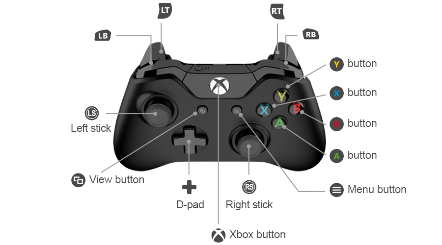

# Control Schema

This document holds notes and guidelines for the player input design.

For 2D platforming games (and alike) a controller is preferred to mouse and keyboard.
While one can also use mouse and keyboard, design prioritizes controller input.

## Controller

An Xbox One Controller is used as reference.

- 1 directional pad (`D-pad`)
- 2 analog sticks (`LS` / `RS`) (clickable)
- 4 face buttons (`A`, `B`, `X`, `Y`)
- 2 shoulder buttons (`LB` / `RB`)
- 2 analog triggers (`LT`, `RT`)
- 2 system buttons (`View` / `Menu`)

The Xbox button is usually controlled by the platform and therefore not usable.
Vibration support is nonessential.

The control schema is organized in multiple *modes of operation*.
Examples for such modes are navigating a menu, traversing the terrain, or fighting enemies.

Some combinations (or quick sequences) of inputs result in *conflicts* as they require a high level of dexterity.
No conflict may occur within the same mode of operation.
Note that modes of operation commonly blend into each other (like traversing the terrain and fighting enemies).
Conflicts are only relevant for designing the default mapping.

The following rules are established:

- All buttons are digital inputs.

- Triggers may be used as buttons.

- `D-pad` can be used as 8 directional input or 4 independent buttons.

- Buttons typically trigger an action the frame they get pressed (not the frame they are released).

- Holding a button can be used to trigger an *associated* action.
  We refer to this as *overloading* a button.

- System buttons are used only for *modal menus* like the pause menu, inventory, map…
  Pressing the corresponding system button again closes the modal menu.

- If the game features digital player movement, movement can be controlled with `LS` as well as `D-pad`.

- Actuating `RS` conflicts with actuating the face buttons.

- Only the following button combinations are valid, other combinations are treated as conflicts:
    - `A` + `X`
    - `B` + `Y`
    - `D-pad` + face button
    - `LB` + `RB`
    - `LT` + `RT`
    - Trigger + face button

- Stick input is generally deemed imprecise and needs additional processing like deadzone or angle snapping.
  Furthermore, visual feedback is required for aiming tasks.

- Flicking a stick triggers the action on the frame the outer radial deadzone is entered.
  The angle of actuation is determined during this frame.
  Note that most sticks tend to overshoot when they are returned to the home position by the builtin spring mechanism.
  Deadzones need to be adjusted accordingly.

- Clicking the sticks is not used in the default control scheme.
  A player can manually bind them to an action of a button at their own discretion.

- A player can swap any button mapping.

- A player can swap the mapping of both sticks.

- A player can swap the mapping of both triggers.
