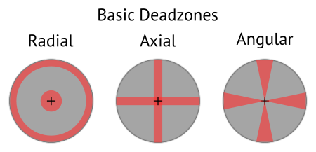

# Control Scheme

This document holds notes and guidelines for the player input design.

For 2D platforming games (and alike) a controller is preferred to mouse and keyboard.
While one can also use mouse and keyboard, design prioritizes controller input.

## Controller

An Xbox One Controller is used as reference.

- 1 directional pad (`D-pad`)
- 2 analog sticks (`LS`, `RS`) (clickable)
- 4 face buttons (`A`, `B`, `X`, `Y`)
- 2 shoulder buttons (`LB`, `RB`)
- 2 analog triggers (`LT`, `RT`)
- 2 system buttons (`View`, `Menu`)

The Xbox button is usually controlled by the platform and therefore not usable.
Vibration support is nonessential.

The control scheme is organized in multiple *modes of operation*.
Examples for such modes are navigating a menu, traversing the terrain, or fighting enemies.

Some combinations or quick sequences of inputs require a high level of dexterity and should therefore be avoided to enhance accessability.
We refer to these as *conflicts*.
Avoiding conflicts is only relevant for designing the default mapping.

The following rules are established:

- All buttons are digital inputs.

- Triggers may be used as buttons, but not for actions that require precise timing.

- `D-pad` may be used either as 8 directional input or 4 independent buttons.

- Buttons should trigger an action the frame they get pressed (not the frame they are released).

- Holding a button may be used to trigger an *associated* action.
  We refer to this as *overloading* a button.

- System buttons are used only for *modal menus* like the pause menu, inventory, map, etc.
  Pressing the corresponding system button again closes the modal menu.
  Actuating system buttons conflicts with actuating `LS`, `RS`, `D-pad`, and any of the face buttons.

- If the game features digital player movement, movement should be controlled with `LS` as well as `D-pad`.

- Actuating `LS` conflicts with actuating `D-pad`.

- Actuating `RS` conflicts with actuating any of the face buttons.

- Only the following button combinations are valid, other combinations are treated as conflicts:
    - `A` + `X`
    - `B` + `Y`
    - `D-pad` + face button
    - `LB` + `RB`
    - `LT` + `RT`
    - Trigger + face button

- When combining a trigger with a face button, `RT` is preferred over `LT`.

- Stick input is deemed imprecise and needs additional processing like deadzoning or angle snapping.
  Furthermore, visual feedback is required for aiming tasks.

- Flicking a stick triggers the action on the frame the outer radial deadzone is entered.
  The angle of actuation is determined during this frame.
  Note that most sticks tend to overshoot when they are returned to the home position by the builtin spring mechanism.
  Deadzones need to be adjusted accordingly.

- Stick flicking must not be used to trigger actions that require precise timing.

- Clicking the sticks is not used in the default mapping.
  A player can manually bind them to an action of a button at their own discretion.

- A player can swap any button mapping.

- A player can swap the mapping of both sticks.

- A player can swap the mapping of both triggers.

### Stick Deadzones

These and other shapes can be combined to create more complex deadzones.
